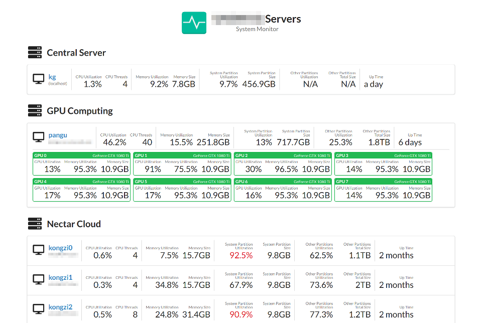
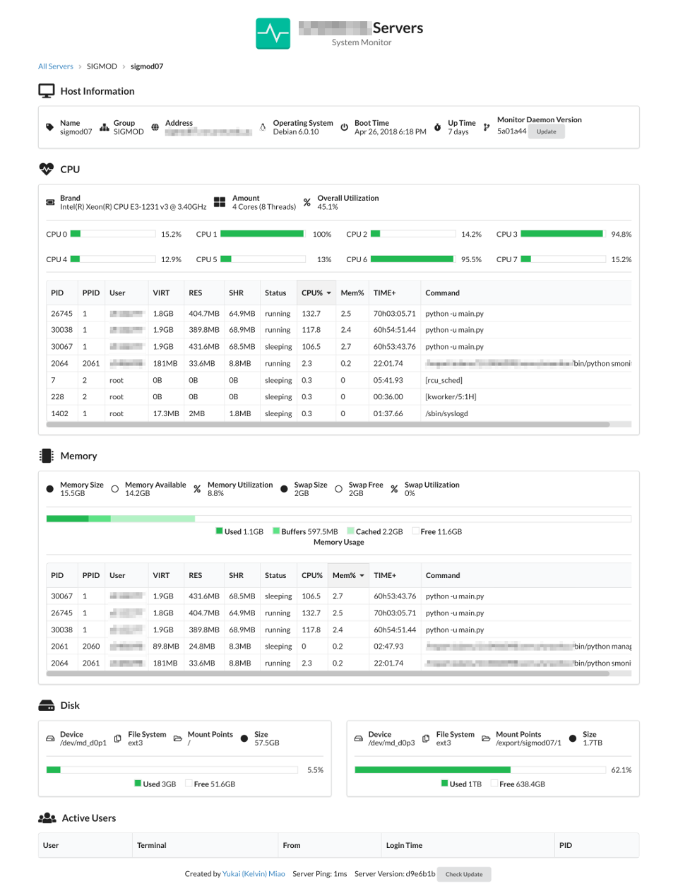
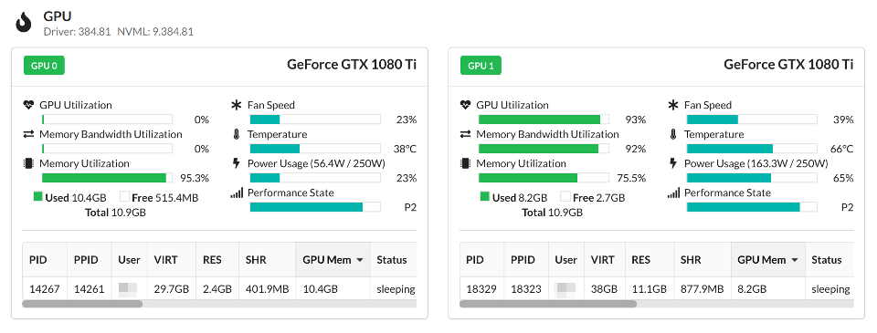

# System Monitor

## Introduction

This is a simple web server for monitoring the status and metrics of multiple hosts in multiple clusters.

### Collected Metrics

* OS (name, version, boot time)
* CPU (brand, amount, utilization)
* Memory (size, utilization)
* Swap (size, utilization)
* Disks (device, fs type, mount point, size, utilization)
* Processes (pid, ppid, user, mem, cpu, time, command)
* Active Users (name, terminal, from address, login time, pid) 

When NVIDIA(R) GPUs and the corresponding driver are installed, it also support the following metrics

* GPUs (utilization, GPU memory utilization, fan speed, temperature, power, [performance state](https://docs.nvidia.com/deploy/nvml-api/group__nvmlDeviceEnumvs.html#group__nvmlDeviceEnumvs_1g9de0cdfc67dfc2704b86344a7d5dc4fb), processes using GPUs)

Note: some of the above GPU metrics are not available for old models of NVIDIA GPUs.

### Supported OS

- Linux
- Windows (Experimental)
- TODO: Mac OS

### Operation Modes

This server supports two operation modes.

1. **Node mode**: It will collect various status and metrics of the local host when requested.
2. **App mode**: It will repeatedly requests and **assembles** the metrics from itself and/or all the other servers running with **node** mode.

Both modes provide a web interface that visualizes the metrics.

## Deployment

### Architecture

A. As depicted in the following diagram, the minimal deployment contains a single server running with **node** mode. This is useful for monitoring a single host. 

```
/--- External Network ---\            

                          +----------+
 UserA  --(WebSocket)-->  |          |
 UserB  --(WebSocket)-->  | Smonitor |
 UserC  --(WebSocket)-->  |  (node)  |
                          |          |
                          +----------+                  
```

B. If there are multiple hosts to monitor, the suggested deployment is as depicted as follows. Here, each monitored host should run the server with **node** mode and a public host should run the server with **app** mode.     


```
/--- External Network ---\            /--- Internal Network ---\

                          +----------+             +----------+
 UserA  --(WebSocket)-->  |          | --(HTTP)--> | Smonitor |
 UserB  --(WebSocket)-->  | Smonitor |             |  (node)  |
 UserC  --(WebSocket)-->  |  (app)   |             +----------+
                          |          |             +----------+
                          |          | --(HTTP)--> | Smonitor |
                          +----------+             |  (node)  |
                                                   +----------+                  
```

### Steps

1. Clone this repository to all the relevant hosts  
2. (Optional) In each host, setup a Python virtual environment and activate it
3. In each host, install the dependencies via `pip install -U -r requirements.txt`
4. In each host, edit configuration file `config.json` (explained later)
5. In each host, run the server (explained later)

### Configuration File

The configuration file is `config.json`, which is excluded from the git tracking. So you have to create this file and edit it as per your use case.

1. For **node** mode, we provide an example configuration file `config_node.json`. You may copy it to `config.json` and edit the content.
2. Similarly, for **app** mode, we also provide an example configuration file `config_app.json`. Just copy it to `config.json` and edit the content.

Most lines of the provided example should be self-explainable. Here we just explain some important points.

* `server` block defines the system-level settings of the monitor server. If you are using a reverse proxy like nginx, you should add `behind_proxy: true` in the `server` block
* `manager` block defines the manager server, which is used to restart the monitor server automatically. `manager.mode` should be 'self' or 'supervisor'. If manager mode is 'self', the manager server handles the lifecycle of the monitor server. If manager mode is 'supervisor', it will rely on supervisor to handle the lifecycle of the monitor server.
* `monitor` block defines the application-level settings of the monitor server. `monitor.mode` should be 'app' or 'node', as described above.

### Supervisor Configurations

In each host, if the manager mode is 'supervisor', please do the following additional steps. Otherwise, please skip this section.

1. Make sure the host has installed `supervisor`. Otherwise, please use `sudo apt install supervisor` to install it. 
2. Run `python supervisor-conf-gen.py` to generate the supervisor configuration files. They will be placed at `supervisor-conf/`
3. Copy the generated files into the supervisor configuration folder (typically `/etc/supervisor/conf.d/`).

### Running

In each host, if the manger mode is 'supervisor', please run the server via `sudo systemctl restart supervisor.service` or `sudo supervisorctl reload`.

Otherwise, simply run the manager via `python manager.py`.

### Security

Since there may be some sensitive information shown in the web interface, e.g. user names and command lines, we highly recommend you to use authentication to protect the servers in public hosts.  

Currently, there is no built-in authentication in this server. However, you may easily add authentication to this server via nginx.

If you decide to use nginx, apart from the regular proxy block, you need to add [an additional block](https://www.nginx.com/blog/websocket-nginx/) for the WebSocket endpoint (`/socket.io/`) because we use WebSocket to transfer real-time data between the server and the clients. 

## Known Issues

- The WebSocket of the server could freeze after running for a long time. We have not found the exact reason for this issue.  

## Disclaimer

Because this is still an on-going (hobby) project, there is no quality assurance and both the architecture and the implementation are subject to change.

## License

[The MIT License (MIT)](LICENSE.md)

## Screenshots

- The home page list all the monitored hosts



- The host detail page shows the detailed metrics of a single host (The following host does not have NVIDIA GPU) 



- If NVIDIA GPUs are installed, GPU status will be added to the host detail page


